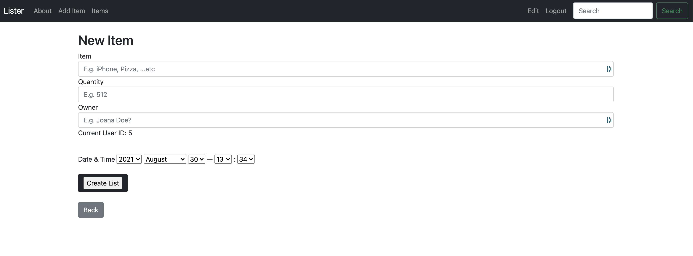
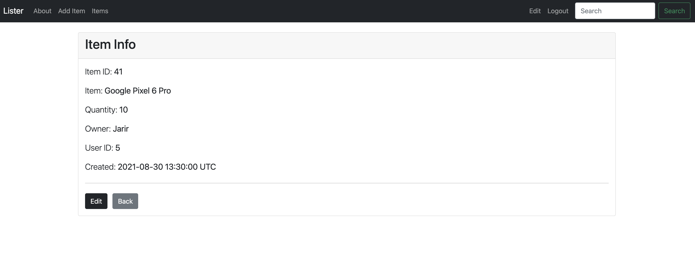
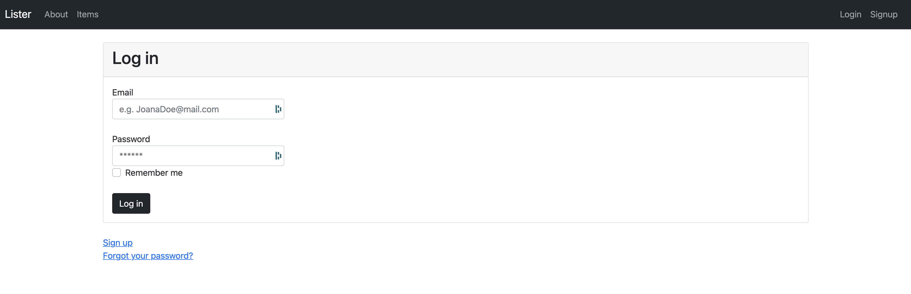

# Lister

A Ruby on Rails Web App/API that applies CRUD functions to create a listing app, to get to know the framework.

Create Item  |  Show Item Info  |  Display Items List  |  Logging In
:-------------------------:|:-------------------------:|:-------------------------:|:-------------------------:
  |    |    |  

